# Pitlane production screenshots

Captured on 11 September 2026 from the actual Vue SPA backed by the isolated Go/SQLite installation. These are browser captures, not the standalone concept. Names, drivers and video belong to the disposable fixture. Track imagery is copied installed content; display illustrations use the six existing `assets/screen-setups/*-transp.png` files.

The native Watch capture uses a real local video embed and the installed Drift map. Its positions/timing come through the protocol fixture. The test video is an ffmpeg pattern, not a physical camera or game render. See [verification results](../PITLANE_IMPLEMENTATION_PROGRESS.md) for the separate 4K native-fullscreen measurements and external acceptance limits.

## Today and session creation

Phone, light theme, 375 CSS pixels. Ready-state actions use actual installation/content readiness.

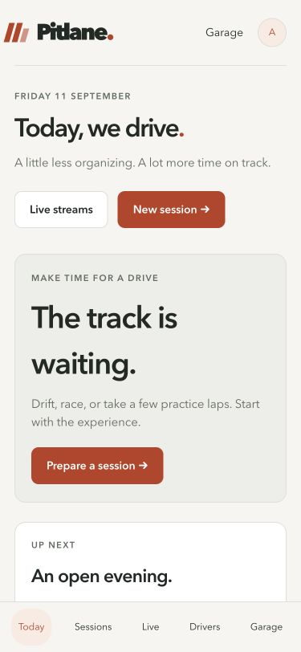

Desktop session creation, 1440 CSS pixels. Installed defaults, expandable driving settings and the exact-configuration review share one journey.

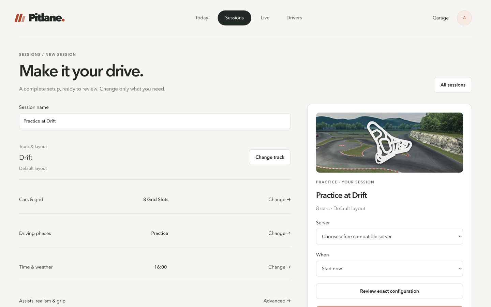

An idle server with no queued event offers the same session builder, with that server preselected. Missing map/current-event state is explicit.

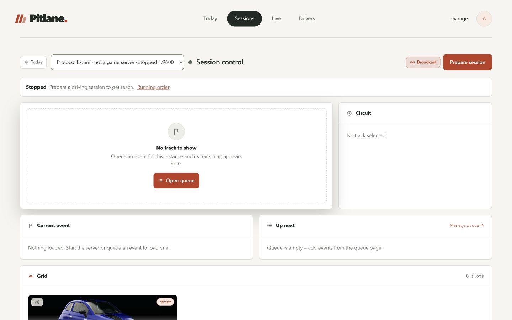

Finished session with persisted executions, attributed driver results and captured moments.

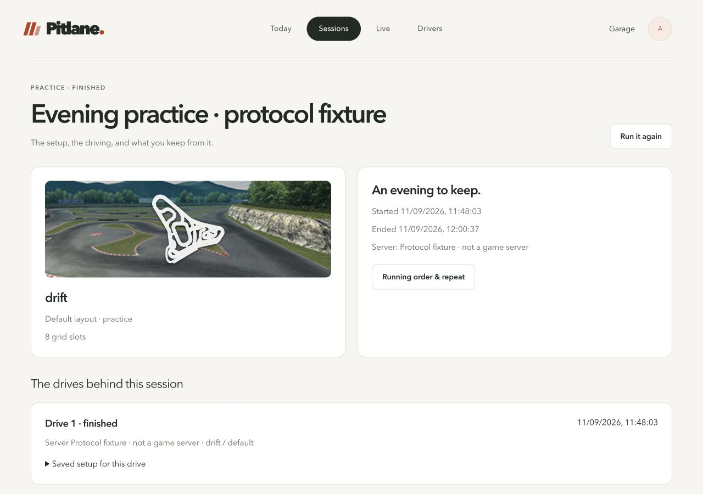

## Watch and Live

Native fullscreen, 1440×900 CSS pixels. The video and map each measure 680×432; the layout also passed 1920×1080, 2560×1440 and 3840×2160 measurements. Driver selection kept native fullscreen active. Stale telemetry is labelled separately from source playback.

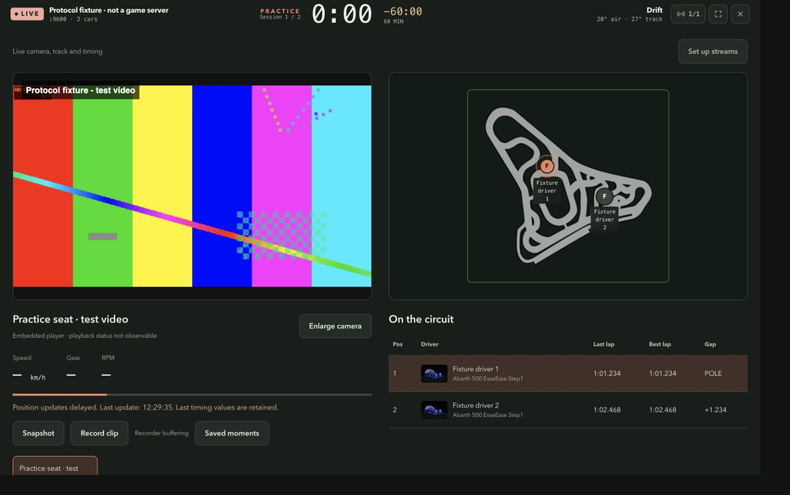

Phone, dark theme. An enabled source remains visible without a connected game driver; playback opens on selection.

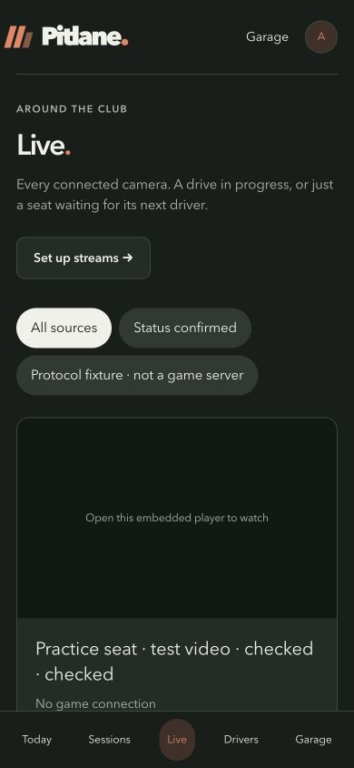

## Drivers and Garage

Driver directory after the visual follow-up: open statistics, circular portraits and one responsive row per person, with actual ingested protocol laps and distinct guest identities.

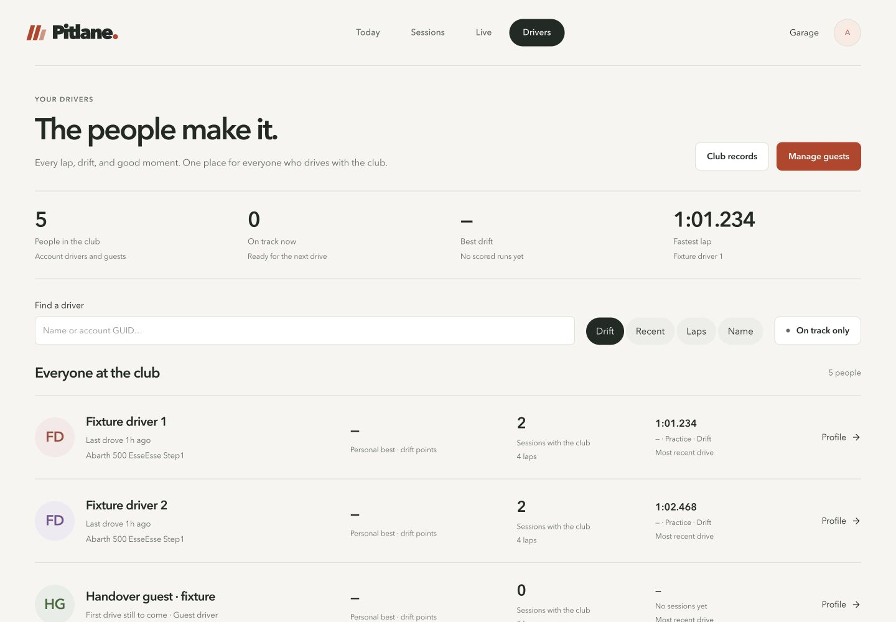

Account profile with the shared Pitlane heading, open statistics and retained detailed history.

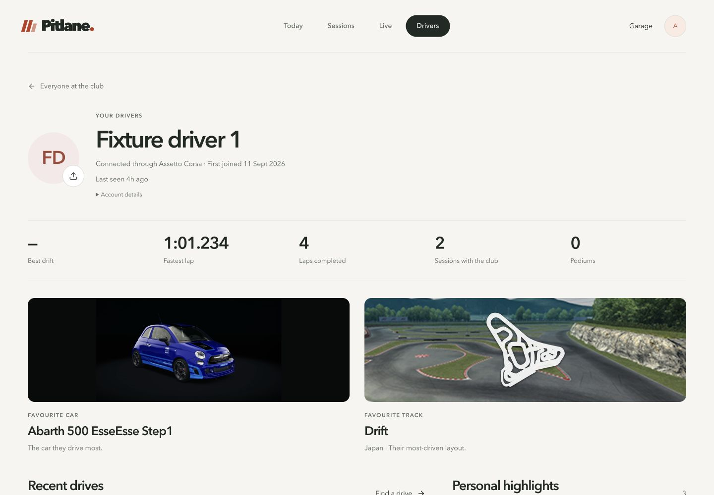

Completed profile body: large favourite imagery, open drive rows and a personal highlights column. The earlier compact nested panels have been replaced.

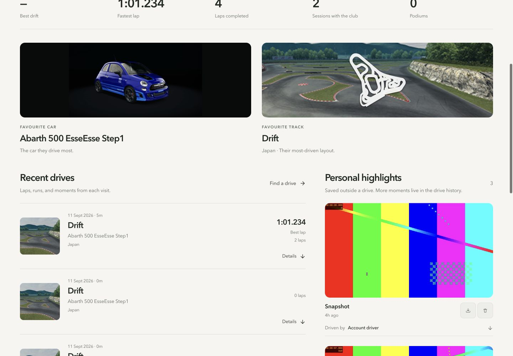

Expanded history retains lap results, tagging and management actions with the same type scale and spacing.

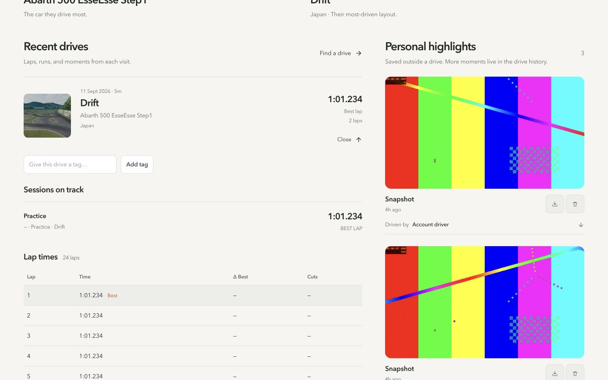

Lower profile and highlights on a 375-pixel phone in dark theme.

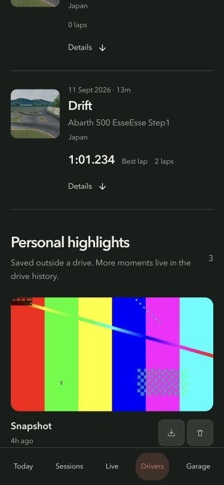

The same account profile on a 375-pixel phone in dark theme.

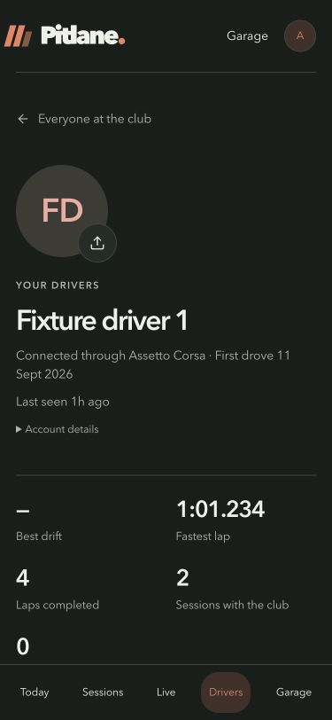

Guest profile uses the same visual language and keeps its separate identity and attributed media.

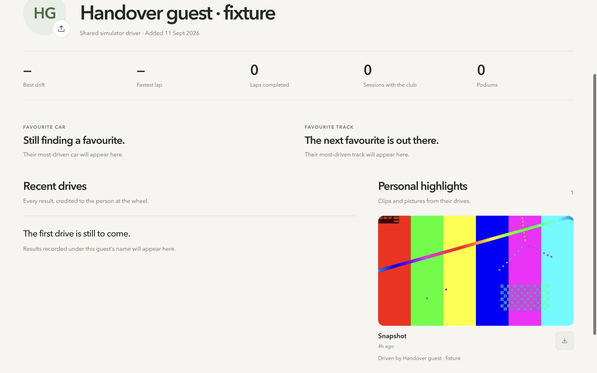

Garage, light theme, with equipment, collection and Advanced destinations and separate server/club sections.

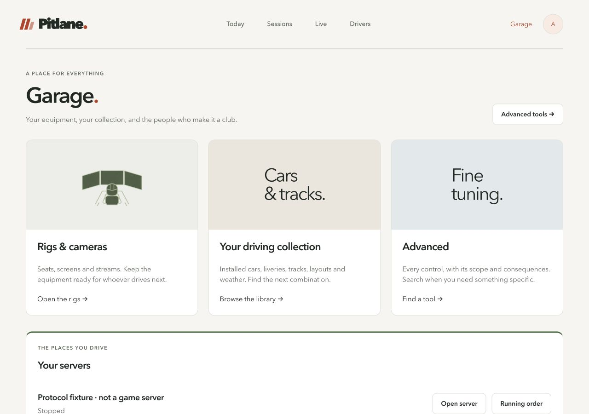

Saved rig detail distinguishes usual driver from current game assignment and lists its attached camera.

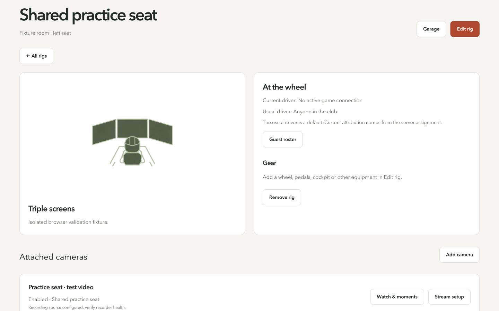

Native rig editor with all six supplied transparent display arrangements.

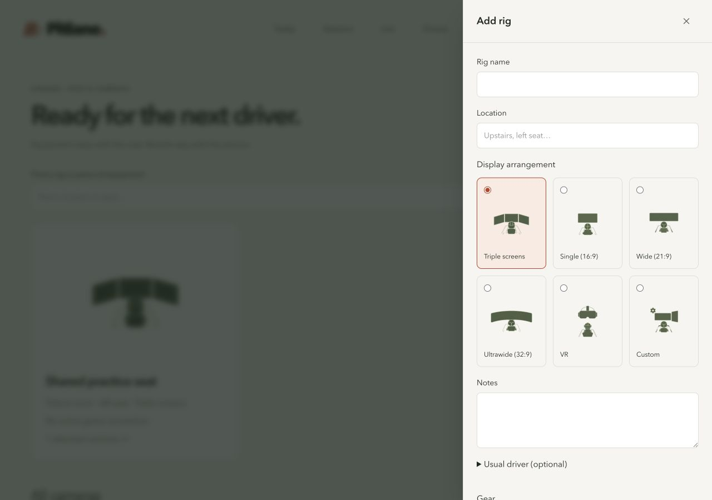

## Library and Advanced

The visual follow-up also updates the shared headers, panels and controls used by the detailed settings pages. Server configuration at 375 pixels in light theme:

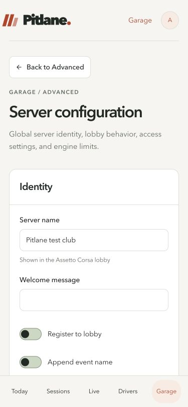

Track detail in dark theme: actual map/layout, local notes/tags, archive and usage controls.

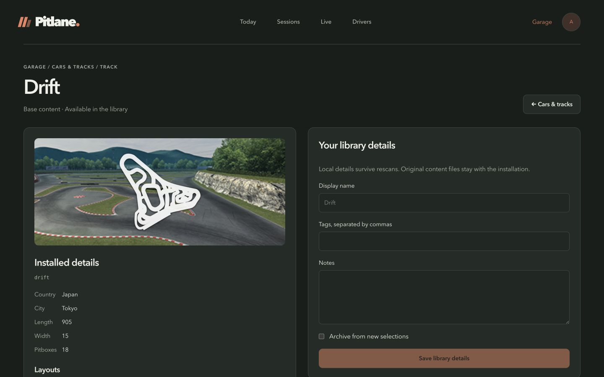

Advanced search on a phone in dark theme. Search includes nested field labels across the 53-tool / 14-section catalogue.

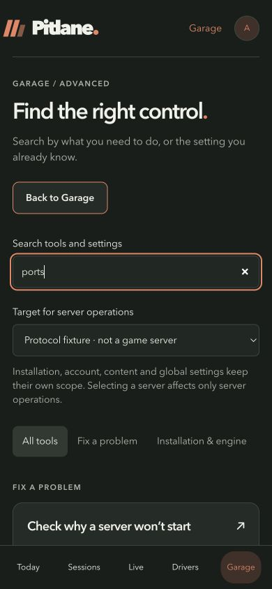
